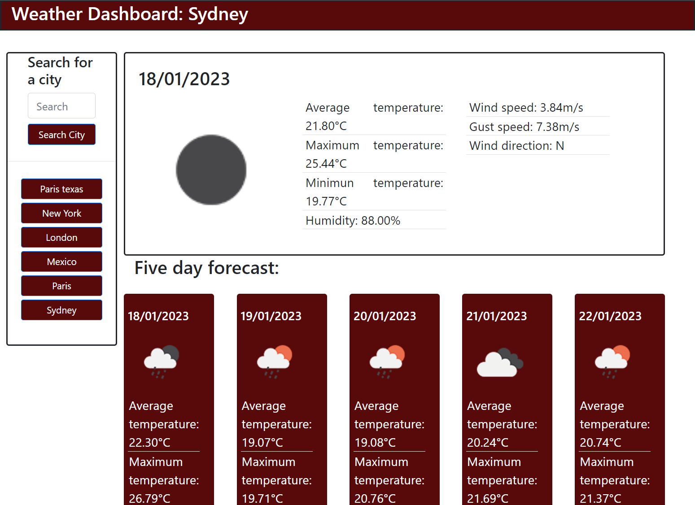

# weather-dashboard

## Description

I have used javascript, HTML and CSS along with third party APIs and stylesheets to make a webpage that displays the weather for major cities around the world. Up to eight previous searches are stored and become clickable buttons to search again. Re-searching the same city (case sensitive) will not add to the past searches as a duplicate.

## Installation

Not Required. 

## Usage

Type your desired city in and search with the button beneath. Weather such as rain or cloud is displayed by icon and detailed weather information is written in the corresponding card.
Access via:  https://lhoole.github.io/weather-dashboard/

## Credits
Html, CSS and Javascript all written by me.
Weather data from https://openweathermap.org/api
Bootstrap styling implimented https://getbootstrap.com/

## License

See LICENSE